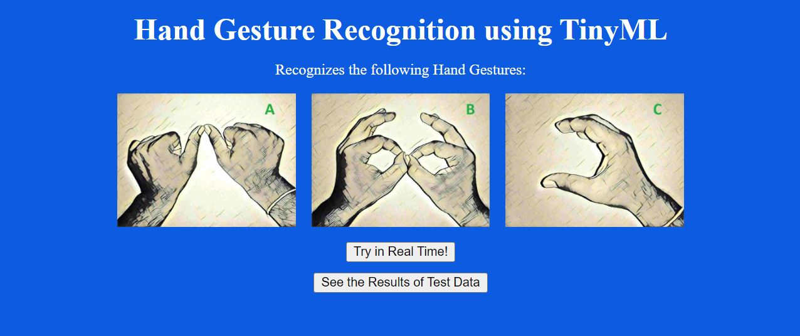

# Hand-Gesture-Recognition-using-TinyML
* ### Recognizes Hand Gestures for English Alphabets using TinyML technology


 ## About
 This is a Hand Gesture Recognition System which aims to recognize the sign language representation of the English Alphabets like A, B and C. The system achieves the recognition ability with the help of TinyML technology which reduces the computations significantly. 
 <br/>
 <br/>
 The recognition model is a LSTM model with 3 Layers of LSTM followed by 3 Dense Layers to produce the predicted alphabet. We take a sequence of pictures as input whose keypoints is identified using Mediapipe library which converts them into a multidimensional array and this array is fed as input to the model. It is built using Tensorflow Libraray and further Tensorflow Lite Libraray has been used to convert the Tensorflow model into Tensorflow Lite(TFLite) model. Further the TFLite model is also converted to a Quantized TFLite model which uses even lesser computations for recognition without much loss in the accuracy. 
 <br/>
 <br/>
 The TFLite models work significantly well as it produces the same output as Tensorflow model in most cases (the difference in the prediction probability comes in 5th or 6th decimal place). The computations are significantly less for TFLite models. 
 <br/><br/>
 On comparison, the TFLite model does 0.001 times the number of computations done by Tensorflow model while Quantized TFLite model further reduces the number of computations by half as it converts 32-bit float computations into 8-bit integer computations. Thus it shows that TinyML technology can help us perform high computation tasks on systems with lesser computation powers as well. Thus TinyML models are easily deployed on Arduinos, Microcontrollers and systems like Raspberry Pi. 
 Here, we have deployed this system on our Windows computer only for test purpose.

 ## Technologies used:
   1. Tensorflow
   2. Tensorflow lite (TinyML)
   3. Keras
   4. Sklearn
   6. OpenCV
   7. Mediapipe

 ## To run the repository on the system:
   1. Clone the repository using "git clone https://github.com/tiwarishubham635/Hand-Gesture-Recognition-using-TinyML.git"
   2. Open the command prompt and create a virtual environment (run ```pip install virtualenv``` if you have not installed virtualenv) by running the following command: <br/> <br/>
      ```
      python -m venv myenv
      .\myenv\Scripts\activate
      ```
   3. Install the dependencies using the requirements.txt file. Just run: <br/> <br/>
      ```
      pip install -r requirements.txt
      ```
   4. Start the app by running: <br/>
   ```
   python app.py
   ```
